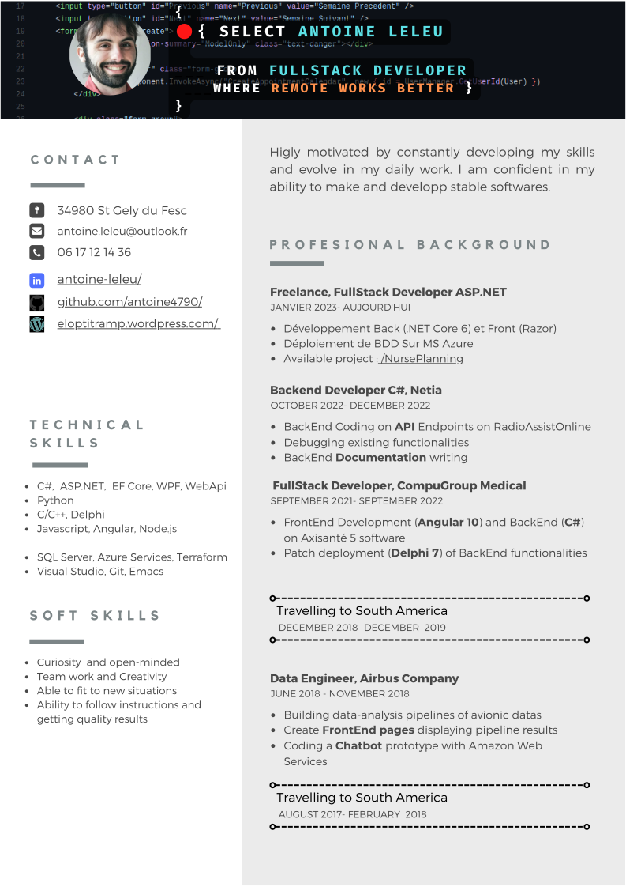
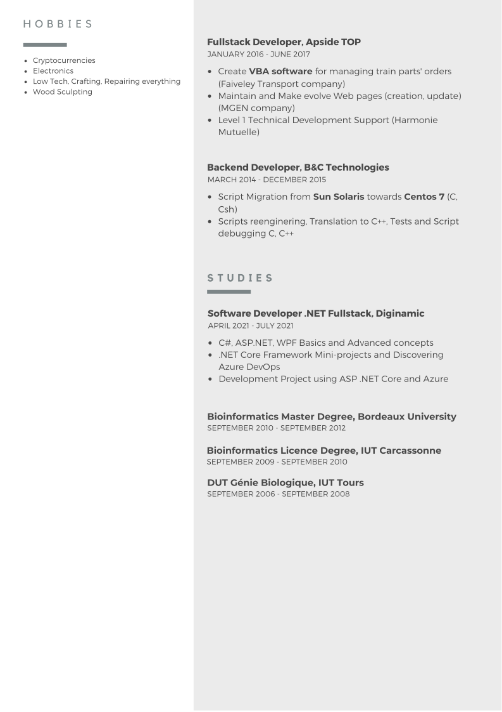

<!-- Google tag (gtag.js) -->

For the <b>ultimate</b> version, click here : 
<button type="button" class="btn btn-link"><a href="https://www.canva.com/design/DAFywI9ludk/IzyIpMFmXY7h_hrcKkCDRw/view?utm_content=DAFywI9ludk&utm_campaign=designshare&utm_medium=link&utm_source=editor" class="btn btn-info" role="button">Check the last version</a></button>

For the <b>Spanish</b> version, click here : 
<button type="button" class="btn btn-link"><a href="https://www.canva.com/design/DAFywAduk8A/N28RldvxrNInA_eS2UFKRQ/view?utm_content=DAFywAduk8A&utm_campaign=designshare&utm_medium=link&utm_source=editor" class="btn btn-info" role="button">Check the last version</a></button>

For the <b>Guarani</b> version, click here : 
<button type="button" class="btn btn-link"><a href="https://www.canva.com/design/DAFywJAQ5vM/xcLcDwuFvzK-n8eBMmcYjA/view?utm_content=DAFywJAQ5vM&utm_campaign=designshare&utm_medium=link&utm_source=editor" class="btn btn-info" role="button">Check the last version</a></button>